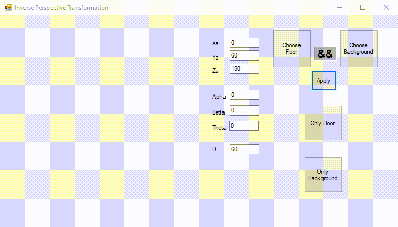

## Inverse-Perspective-Transformation

### Inverse perspective to a plane surface with texture mapping

###Features
- Changing camera position
- Changing the depth value
- Texture selection (floor - background)

